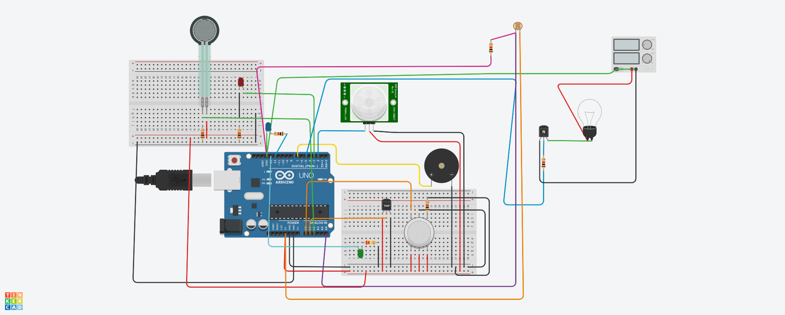

# 🏢 Shopping Mall Safety System (IoT Project)

## Overview  
This project is an **IoT-based smart safety system** for shopping malls.  
It uses **Arduino** and **various sensors** to monitor and ensure safety in different mall areas.  
The system detects **temperature, gas leaks, motion, lift overload, and light conditions** to enhance security.  

Developed using **Tinkercad simulation**, this project was primarily designed during the **pandemic**  
to automate safety checks at the **mall entrance, lift, emergency situations, and lighting systems**.

---

## 🎥 Tinkercad Simulation  
🔗 [View the Tinkercad Simulation](https://www.tinkercad.com/things/jNPbw7suQcu-copy-of-projecttry?sharecode=obAQlgM1U2_WzgWH2C1CFTvNPpB1penJstEtgUPz7-I)  

---

## 🔧 Components Used  

| Name | Quantity | Component |
|------|----------|-----------|
| **U1** | 1 | Arduino Uno R3 |
| **U2** | 1 | Temperature Sensor (TMP36) |
| **GAS1** | 1 | Gas Sensor |
| **D1** | 1 | Blue LED |
| **PIEZO1** | 1 | Piezo Buzzer |
| **R1, R2, R5, R6, R7, R10** | 6 | 1 kΩ Resistors |
| **PIR1** | 1 | PIR Motion Sensor |
| **D2** | 1 | Green LED |
| **R3** | 1 | 220 kΩ Resistor |
| **R4** | 1 | Force Sensor |
| **D3** | 1 | Red LED |
| **T2** | 1 | NPN Transistor (BJT) |
| **L1** | 1 | Light Bulb |
| **P3** | 1 | 4.7V, 25V Power Supply |
| **R9** | 1 | Photoresistor (LDR) |

---

## ⚙️ Functionality of Each Sensor  

### 1️⃣ **Temperature Sensor (TMP36)**
- 📍 **Placement**: At the **mall entrance**.
- 📊 **Function**: Measures **temperature** and ensures safety during **pandemic times**.
- 🔔 **Action**: If temperature exceeds **70°C**, an **LED alert** is triggered.

### 2️⃣ **Gas Sensor**
- 📍 **Placement**: Inside the **mall premises**.
- 📊 **Function**: Detects **gas leaks or smoke**.
- 🔔 **Action**: If harmful gases are detected, a **buzzer alarm** goes off.

### 3️⃣ **Photoresistor (LDR)**
- 📍 **Placement**: **Outside the mall**.
- 📊 **Function**: Detects **sunlight intensity**.
- 💡 **Action**:
  - If **sunlight is dim**, the **mall lights turn ON**.
  - If **sunlight is bright**, the **lights turn OFF**.

### 4️⃣ **Force Sensor**
- 📍 **Placement**: Inside the **mall lift (elevator)**.
- 📊 **Function**: Detects **lift overload**.
- 🔔 **Action**: If the force exceeds a certain limit, a **warning is displayed**.

### 5️⃣ **PIR Motion Sensor**
- 📍 **Placement**: Near the **mall doors**.
- 📊 **Function**: Detects **human motion**.
- 🚪 **Action**: If motion is detected, **mall doors automatically open**.

---

## 🚀 How to Run This Project on Tinkercad  

1. **Open the Tinkercad Simulation**  
   - Click on the **Tinkercad link** provided above.  
   - Sign in to **copy** and edit the project.  

2. **Access the Code**  
   - Open the **"Code"** section in Tinkercad.  
   - Copy the code from the **`code.txt`** file (available in this repository).  
   - Paste it into the **Tinkercad text-based code editor**.

3. **Start the Simulation**  
   - Click the **"Start Simulation"** button in Tinkercad.  
   - The circuit will run, and the sensors will respond based on the logic in the code.  

4. **Test the System**  
   - Simulate different conditions in Tinkercad by adjusting sensor values.  
   - Observe how the **LEDs, buzzer, and automatic door** respond.  

---

## 📜 Code  
The full Arduino simulation code for this project is available in the **`code.txt`** file.  
You can copy it and run it directly in **Tinkercad's code editor**.  

---

## 📸 Circuit Diagram  
Below is the **Tinkercad circuit setup** for this project:  

  

